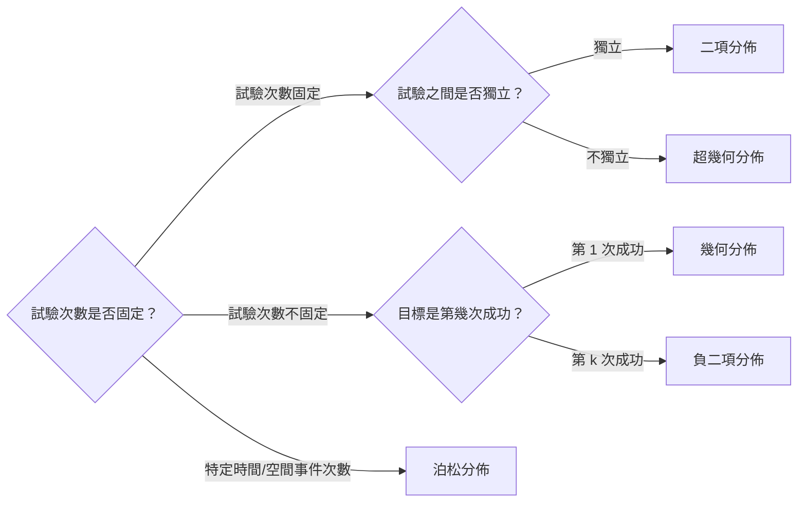

# Summary

For random variable $X$,

​	Mean / Expected value : $E(X) = \sum \text{(All possible values)} \times \text{(Probability of the value)}$

​	Variance : $Var(X) = E(X^2) - [E(X)]^2$

‍

|Distribution|PMF|MGF|Notations|Mean & Variance|Explanation|
| ---| ---| ---| :--| ---| ---|
|Binomial Distribution $X \sim B(n,p)$ |$C^n_x p^x (1-p)^{n-x}$|$((1-p)+pe^t)^n$|$n$ : No. of trials $x$ : No. of success $p$ : Prob. of success|$\begin{aligned} E(X) &= np\\ Var(X) &= np(1-p) \end{aligned}$ |With replacement (independent event)|
|Hypergeometric Distribution $X \sim HG(N_1, N_2, n)$|$\frac{C^{N_1}_x \times C^{N_2}_{n-x}}{C^N_n}$|-  (Too complicated) |$N_1$ : Choice 1 (Desired) $N_2$ : Choice 2 $x$ : No. of success $n$ : No. of trials|$\begin{aligned} E(X) &= n\left( \frac{N_1}{N} \right)\\ Var(X) &= n\left( \frac{N_1}{N} \right) \left( \frac{N_2}{N} \right) \left( \frac{N-n}{N-1} \right)  \end{aligned}$|Without replacement|
|Poisson Distribution $X \sim \text{Poisson}(\lambda = np)$ |$\frac{\lambda^x e^{-\lambda}}{x!}$|$e^{\lambda (e^t -1)}$|$\lambda$ : No. of occurrence in interval $t$ : Length of interval $x$ : Desired no. of occurrence|$\begin{aligned} E(X) &= \lambda\\ Var(X) &= \lambda \end{aligned}$|在一個固定的間隔內，某個事件發生次數的概率|
|Geometric Distribution $X \sim \text{Geom}(p)$ |$(1-p)^{x-1}p$|$\frac{pe^t}{1-(1-p)e^t}$|$p$ : Prob. of success $x$ : No. of trial required for success|$\begin{aligned} E(X) &= \frac{1}{p}\\ Var(X) &= \frac{1-p}{p^2} \end{aligned}$|計算獲得第一次成功所需的總試驗次數 (Memoryless Property : 過去的試驗結果不影響未來的試驗)|
|Negative Binomial Distribution $X \sim NB(r,p)$|$C^{x-1}_{r-1} p^r (1-p)^{x-r}$|$\left(  \frac{pe^t}{1-(1-p)e^t} \right)^r$|$r$ : No. of success $p$ : Prob. of success $x$ : No. of trials required|$\begin{aligned} E(X) &= \frac{r}{p}\\ Var(X) &= \frac{r(1-p)}{p^2} \end{aligned}$|計算獲得 $r$ 次成功所需的總試驗次數 $X$|

|Key Difference|Distribution|Explanation|
| ---------------------| -----------------------------| ----------------------|
|With replacement|Binomial distribution|It's independent|
|Without replacement|Hypergeometric distribution|It's not independent|

|Distribution|Fixed Factor|Random Variable ($X$)|
| --------------------------------| ----------------| ------------------------|
|Binomial Distribution|No. of trials|No. of success|
|Negative Binomial Distribution|No. of success|No. of trials required|

